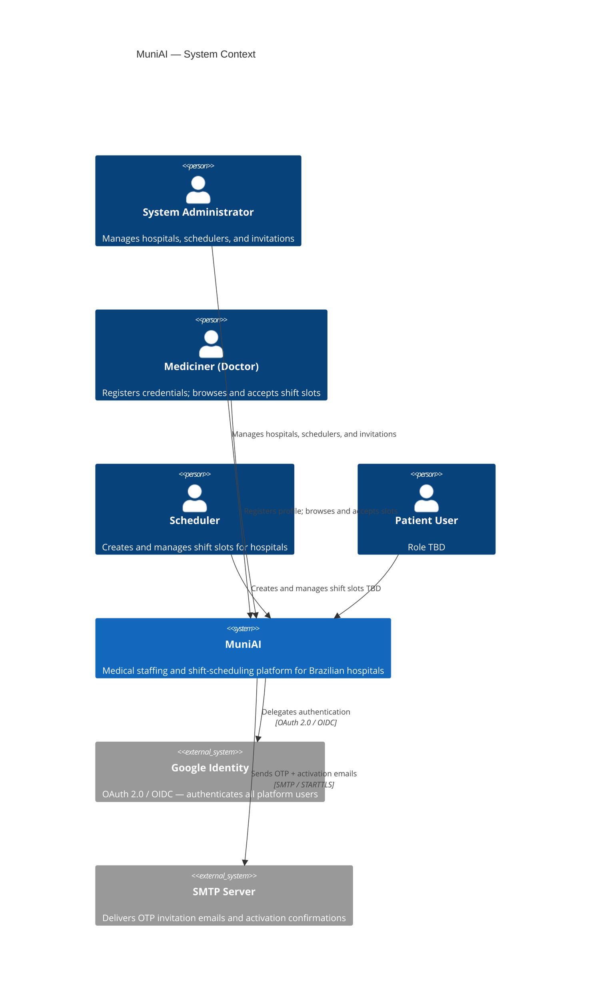
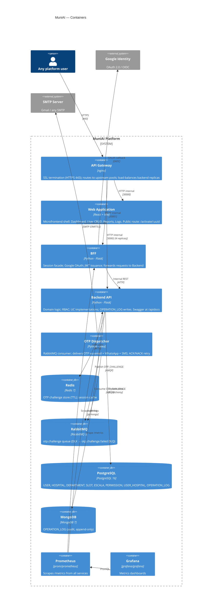

# C4 Architecture Diagrams

---

## Level 1 — System Context

Who uses MuniAI and what external systems does it depend on.

---

## Level 2 — Containers

Internal building blocks of the MuniAI platform.

---

## Key Design Decisions

| Concern | Decision |
|---|---|
| **Auth** | Google OAuth via BFF; bootstrap SAs in YAML; all other users resolved from DB (`active` status required) |
| **JWT** | `sub` = USER.uuid (or Google sub for bootstrap SA); `role` from DB |
| **OTP delivery** | Async via RabbitMQ — Redis stores OTP immediately so `verify()` is instant; consumer delivers all channels |
| **Retry / DLQ** | Transient failures → NACK requeue; permanent failures (bad credentials, invalid address) → DLQ `otp.challenge.failed` |
| **Activation link** | OTP email includes `APP_URL/activate/:uuid` button; invitee verifies on public page without logging in |
| **Activation email** | Sent by `ApproveUserUseCase` after SA approves; notifies invitee they can now sign in |
| **RBAC** | Internal: PERMISSION table (role → resource → action) + USER_HOSPITAL for hospital-scoped roles |
| **Audit** | OPERATION_LOG written in same DB transaction as the main write; append-only |
