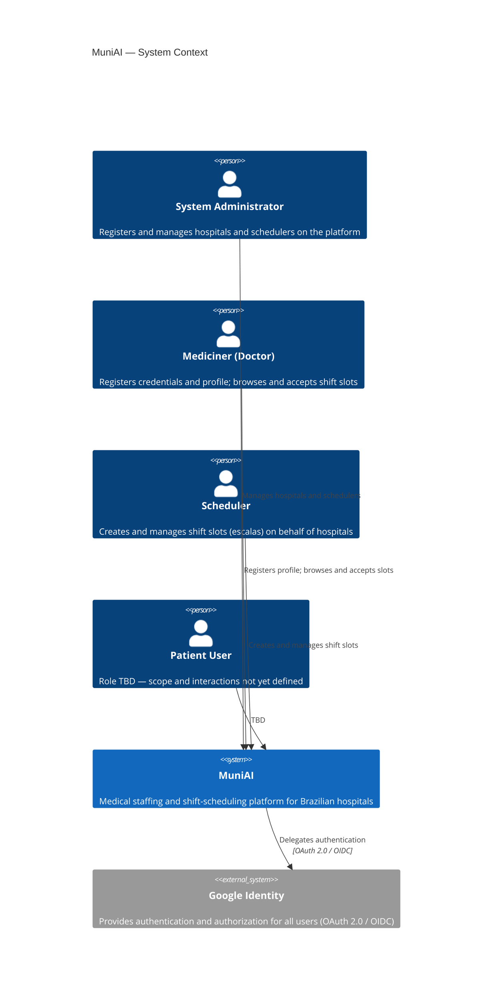
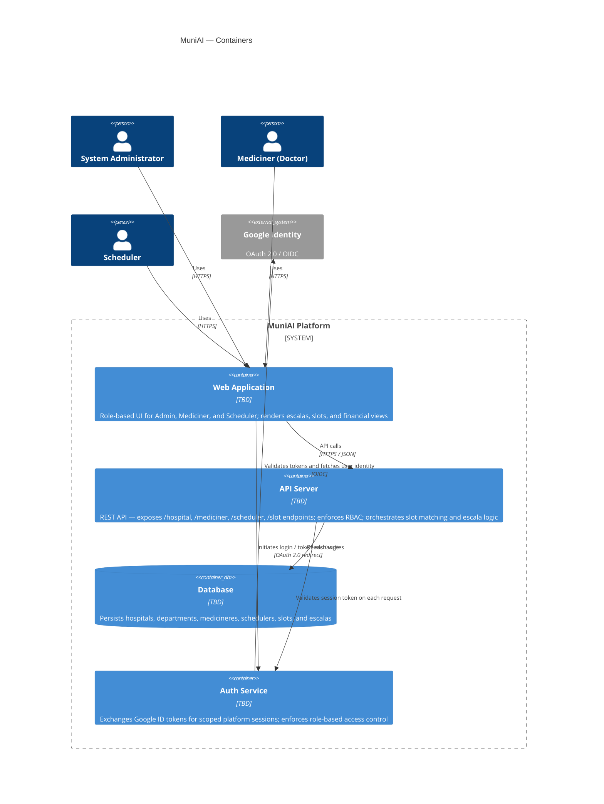

# C4 Architecture Diagrams

> Design phase — technology choices are marked **TBD**. Diagrams will be updated as decisions are made.

---

## Level 1 — System Context

Who uses MuniAI and what external systems does it depend on.

---

## Level 2 — Containers

Internal building blocks of the MuniAI platform.

---

## Open Questions

See `Notes.md` for unresolved design decisions that may affect these diagrams.
