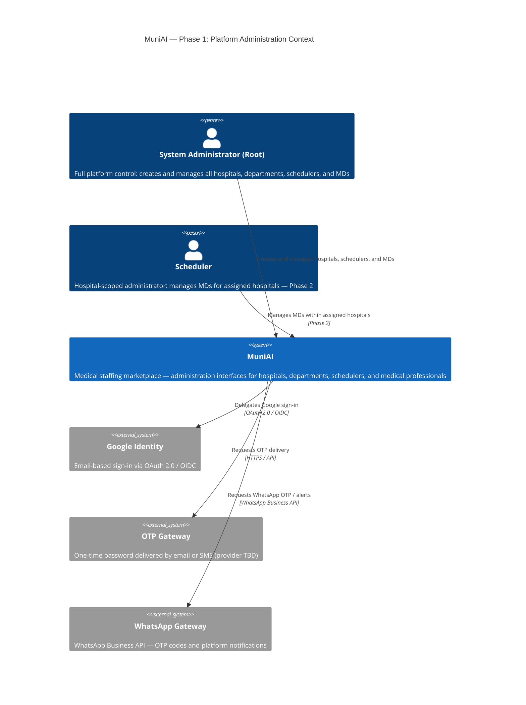

# C4 Context — Phase 1: Platform Administration

> Scope: first operational phase — System Administrator sets up the platform by registering hospitals, schedulers, and medical professionals (MDs).  
> Scheduler-level administration (managing their own MDs) is acknowledged here but activated in **Phase 2**.

---

## Mermaid — quick preview



---

## PlantUML C4 — canonical diagram

```plantuml
@startuml Phase1-Admin-Context
!include https://raw.githubusercontent.com/plantuml-stdlib/C4-PlantUML/master/C4_Context.puml

LAYOUT_WITH_LEGEND()

title MuniAI — Phase 1: Platform Administration Context

Person(rootAdmin, "System Administrator (Root)", "Full platform control:\ncreates and manages all hospitals,\nschedulers, and medical professionals (MDs)")
Person(scheduler, "Scheduler", "Hospital-scoped administrator:\nmanages MDs for assigned hospitals\n[Phase 2]")

System(muniAI, "MuniAI", "Medical staffing marketplace —\nadministration interfaces for\nhospitals, departments, schedulers, and MDs")

System_Ext(googleId, "Google Identity",  "Email-based sign-in\nOAuth 2.0 / OIDC")
System_Ext(otpGw,    "OTP Gateway",      "One-time password\nvia email or SMS\n(provider TBD)")
System_Ext(waGw,     "WhatsApp Gateway", "WhatsApp Business API —\nOTP codes and platform notifications")

Rel(rootAdmin, muniAI,  "Creates and manages\nhospitals, schedulers, MDs")
Rel(scheduler, muniAI,  "Manages MDs for\nassigned hospitals", "Phase 2")
Rel(muniAI, googleId,   "Google sign-in",              "OAuth 2.0 / OIDC")
Rel(muniAI, otpGw,      "OTP delivery",                "HTTPS / API")
Rel(muniAI, waGw,       "WhatsApp OTP / alerts",       "WhatsApp Business API")

@enduml
```

---

## Administrator Scope Model

| Role | Scope | Manages |
|---|---|---|
| **Root System Administrator** | Full platform | All hospitals · all schedulers · all MDs |
| **Scheduler** *(Phase 2)* | Assigned hospital(s) | MDs within those hospitals only |

## Authentication Options

All roles share the same identity layer. Users choose one method at login:

| Method | Mechanism | Notes |
|---|---|---|
| **Google Sign-In** | OAuth 2.0 / OIDC | Requires a Google account linked to the registered e-mail |
| **Email OTP** | One-time password to e-mail | Fallback for users without a Google account |
| **WhatsApp OTP** | OTP code via WhatsApp | Preferred for users with no corporate e-mail; widely used in Brazil |

> **Open decision:** will all three methods launch together, or start with Google and add OTP/WhatsApp progressively?
