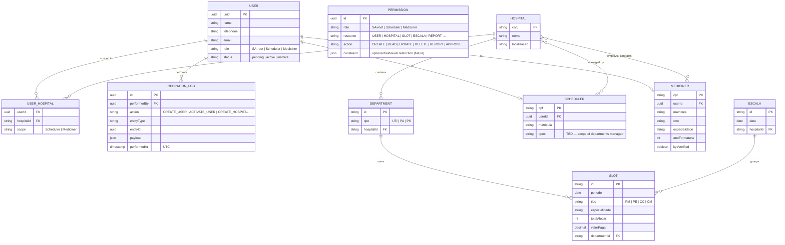

# Domain Model

> Derived from the initial Miro board and use-case definitions. Fields marked `TBD` require a decision.

## Entity Notes

| Entity | Notes |
|---|---|
| `User` | Base auth entity for all actors. `uuid` is the platform identity — embedded in JWT `sub` claim and in every `OPERATION_LOG` entry. `role` (coarse grain) is also carried in the JWT. SA-root has no separate domain entity. |
| `User_Hospital` | Junction table that restricts Scheduler and Mediciner to their assigned hospitals. SA-root bypasses this check (platform-wide access). A Scheduler managing two hospitals has two rows. |
| `Permission` | Internal RBAC table seeded at deployment, managed by SA-root. Maps role → resource → action. Checked by Backend on every protected request. Supports future field-level constraints via the `constraint` JSON column. Example seed rows: `(SA-root, USER, CREATE)` · `(Scheduler, SLOT, CREATE)` · `(Mediciner, SLOT, UPDATE)`. |
| `Operation_Log` | Append-only audit table. Written in the **same DB transaction** as the main operation — if the main write rolls back, the log entry rolls back with it. Never updated or deleted. `performedBy` is the USER.uuid of the actor; for system-initiated actions (e.g. IaC seed), a reserved system UUID is used. |
| `Hospital` | Registered by SysAdmin. CNPJ is the Brazilian legal entity identifier. |
| `Department` | Three confirmed types: **UTI** (Unidade de Terapia Intensiva / ICU) · **PA** (Pronto Atendimento / Urgent Care) · **PS** (Pronto Socorro / Emergency Room). Additional types TBD. |
| `Scheduler` | Registered by SysAdmin. Extends USER. `tipos` field scope TBD. |
| `Mediciner` | Extends USER. KYC verification process TBD. |
| `Slot` | Unit of work. Types: **PM** Physician On-Call · **PE** Nursing Duty · **CC** Operating Room · **CM** Outpatient Consultation. |
| `Escala` | Schedule grouping slots for a hospital period. Sub-modules TBD. |

## Authorization Flow (every protected request)

1. Validate JWT signature (IdP public key).
2. Extract `sub` (USER.uuid) and `role` from claims.
3. Check `PERMISSION` — deny if `(role, resource, action)` has no matching row.
4. For Scheduler / Mediciner: check `USER_HOSPITAL` — deny if user has no row for the target hospital.
5. Execute operation; write `OPERATION_LOG` in the same transaction.
