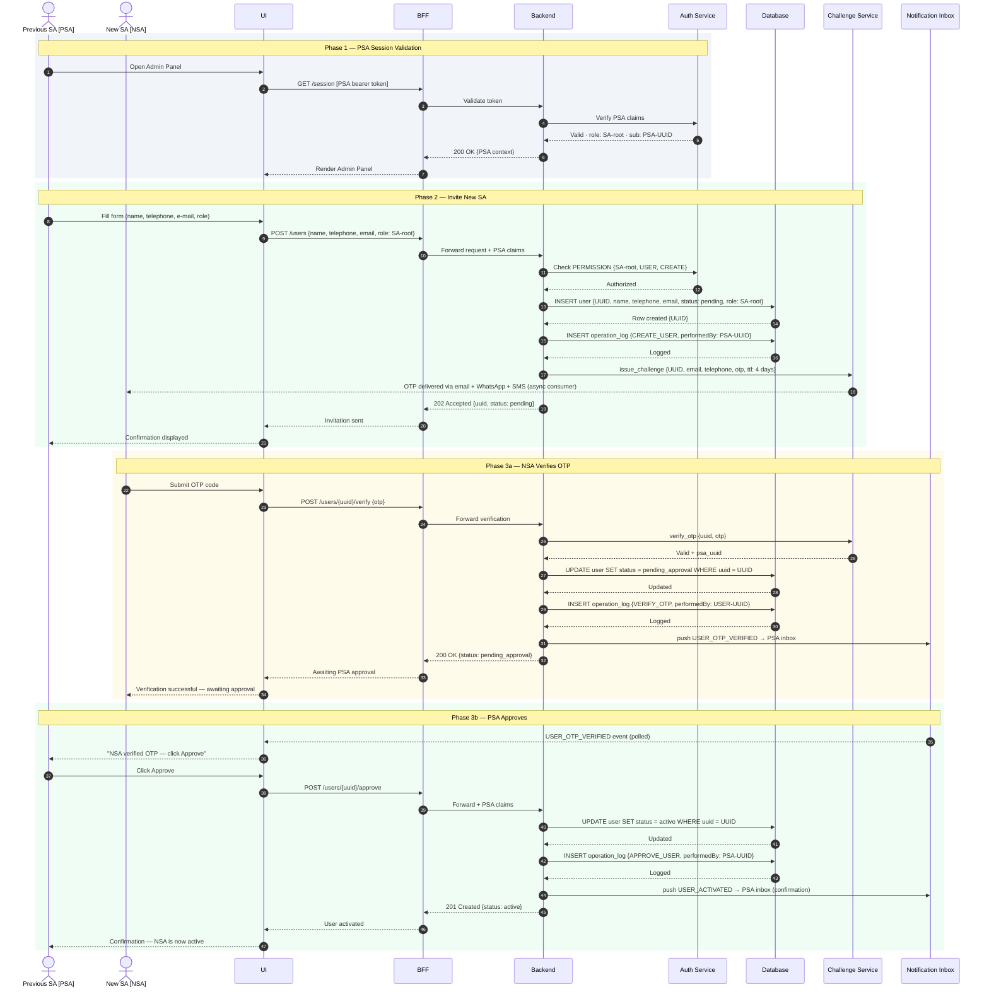
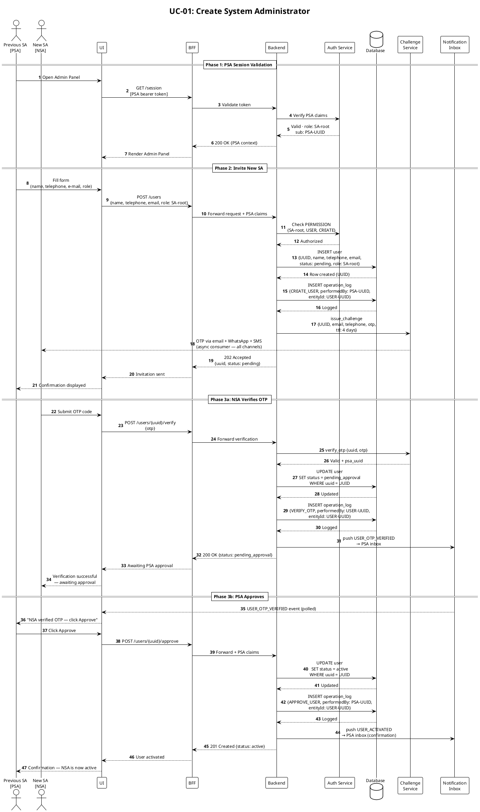

# UC-01: Create System Administrator — Sequence Diagram

> **Bootstrap note:** the initial SA (`sa-0`) is seeded via IaC. All subsequent SAs are created by an existing SA-root through this flow.

---

## Actors & Participants

| Symbol | Meaning |
|---|---|
| **PSA** | Previous System Administrator — authenticated SA-root who initiates the creation |
| **NSA** | New System Administrator — not yet a user; receives the OTP out-of-band |
| **UI** | Frontend application |
| **BFF** | Backend for Frontend — session validation, request forwarding |
| **Backend** | Core API — business logic, authorization enforcement, OPERATION_LOG writes |
| **Auth Service** | Issues and validates tokens; enforces RBAC via claims + PERMISSION table |
| **Database** | Persists USER, OPERATION_LOG (same transaction) |
| **Challenge Service** | Publishes OTP to message queue; async consumer delivers via **email + WhatsApp + SMS** (all channels). Single-channel failure does not fail the flow. OTP TTL: **4 days**. |
| **Notification Inbox** | In-memory (dev) / persistent (prod) per-PSA event inbox, polled by the UI |

---

## Resolved Decisions

| # | Question | Answer |
|---|---|---|
| 1 | Default challenge channel? | **All channels** — email + WhatsApp + SMS dispatched asynchronously via message consumer to avoid single-channel unavailability failing the invitation |
| 2 | Challenge TTL? | **4 days** (345 600 s) |
| 3 | Does PSA receive notification when NSA activates? | **Yes** — `USER_OTP_VERIFIED` event when NSA verifies OTP (prompts PSA to approve); `USER_ACTIVATED` confirmation after PSA approves |
| 4 | Can PSA cancel a pending invitation? | **Yes** — from both `pending` and `pending_approval` states |

---

## Mermaid — quick preview

---

## PlantUML — canonical diagram

---

## USER Entity (introduced in this use case)

| Field | Type | Notes |
|---|---|---|
| `uuid` | UUID | Primary key — generated by backend on creation |
| `name` | string | Full name |
| `telephone` | string | Used for WhatsApp / SMS challenge delivery |
| `email` | string | Used for email OTP challenge and login |
| `role` | enum | `SA-root` · `Scheduler` · `Mediciner` (extensible) |
| `status` | enum | `pending` → `pending_approval` → `active` → `inactive` |

> The `uuid` is embedded in JWT claims and in every `OPERATION_LOG` entry, providing a traceable identity for all platform actions.
