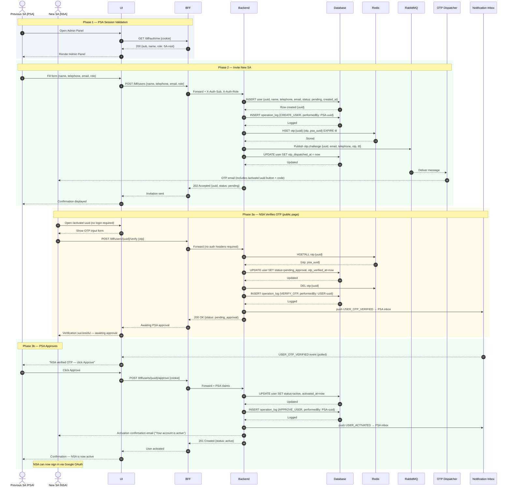
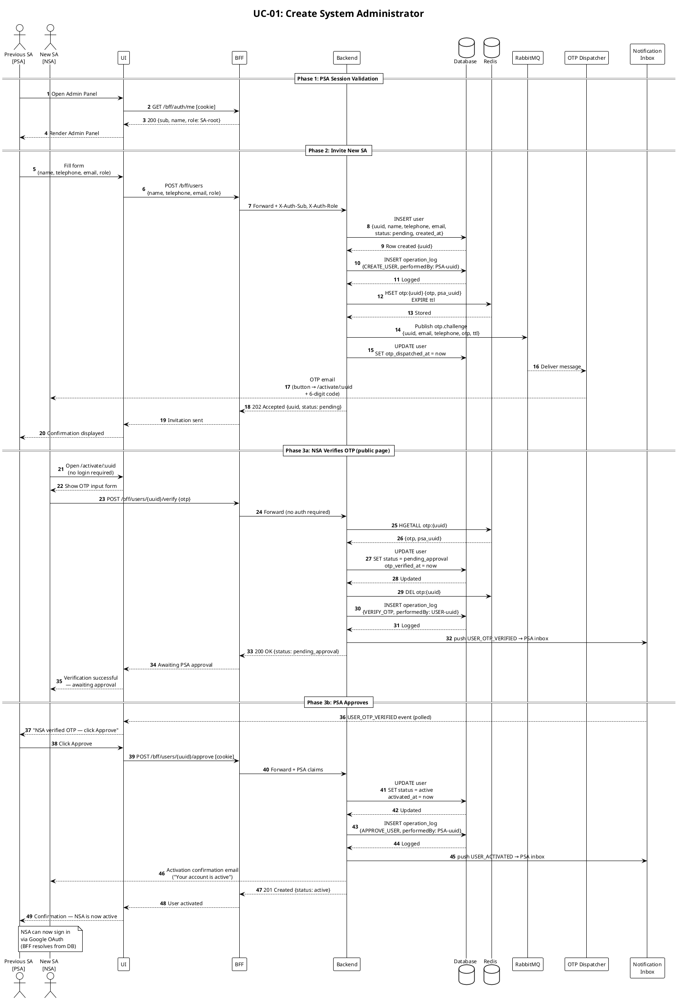

# UC-01: Create System Administrator — Sequence Diagram

> **Bootstrap note:** the initial SA is listed in `services/bff/resources/authorized_psas.yaml`. All subsequent SAs are created by an existing SA-root through this flow and stored in the database.

---

## Actors & Participants

| Symbol | Meaning |
|---|---|
| **PSA** | Previous System Administrator — authenticated SA-root who initiates the invitation |
| **NSA** | New System Administrator — receives OTP email; activates account via public link |
| **UI** | Frontend application (React + Vite) |
| **BFF** | Backend for Frontend — Google OAuth, JWT issuance, request forwarding (Flask) |
| **Backend** | Core API — business logic, RBAC enforcement, OPERATION_LOG writes (Flask) |
| **DB** | PostgreSQL — persists USER, OPERATION_LOG |
| **Redis** | OTP challenge store — immediate persistence so `verify()` is independent of the queue |
| **RabbitMQ** | Message broker — `otp.challenge` queue with DLX → `otp.challenge.failed` DLQ |
| **Dispatcher** | OTP consumer — delivers via email + WhatsApp + SMS; ACK on success, NACK on failure |
| **NI** | Notification Inbox — in-memory per-PSA event inbox, polled by the UI |

---

## Resolved Decisions

| # | Question | Answer |
|---|---|---|
| 1 | Default challenge channels? | **All channels** — email + WhatsApp + SMS dispatched asynchronously |
| 2 | Challenge TTL? | **4 days** (345 600 s) |
| 3 | Does PSA receive notification when NSA verifies OTP? | **Yes** — `USER_OTP_VERIFIED` pushed to PSA inbox; UI polls and shows "click Approve" |
| 4 | Does NSA receive a confirmation email on activation? | **Yes** — `send_activation_email()` called by `ApproveUserUseCase` after activation |
| 5 | Can PSA cancel a pending invitation? | **Yes** — from both `pending` and `pending_approval` states; INACTIVE record preserved for audit trail and can be re-invited |
| 6 | How does NSA verify OTP? | Via public `/activate/:uuid` page (no login required); email contains direct link + code |
| 7 | Permanent delivery failures? | NACKed with `requeue=False` → routed to `otp.challenge.failed` DLQ via dead-letter exchange |

---

## Mermaid — quick preview



---

## PlantUML — canonical diagram



---

## USER Entity Timestamps

| Field | Set when |
|---|---|
| `created_at` | Record created (invitation sent) or re-invited |
| `otp_dispatched_at` | `issue_challenge()` returns successfully |
| `otp_verified_at` | Invitee submits correct OTP via `/activate/:uuid` |
| `activated_at` | SA clicks Approve |

---

## OTP Retry & DLQ

```
otp.challenge  ──► dispatcher consumer
     │
     │ NACK requeue=True  (transient failure — network, timeout)
     │   └─► message requeued, redelivered to next consumer
     │
     │ NACK requeue=False  (PermanentDeliveryError — bad credentials, invalid address)
     │   └─► broker routes via otp.challenge.dlx exchange
     │           └─► otp.challenge.failed  (DLQ)
     │                 inspect at /rabbitmq management UI
```
