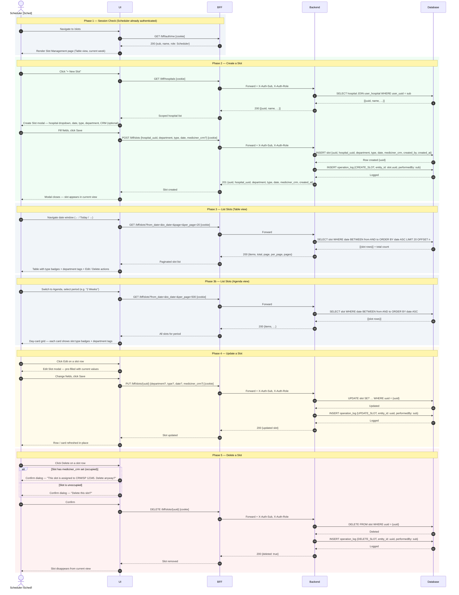
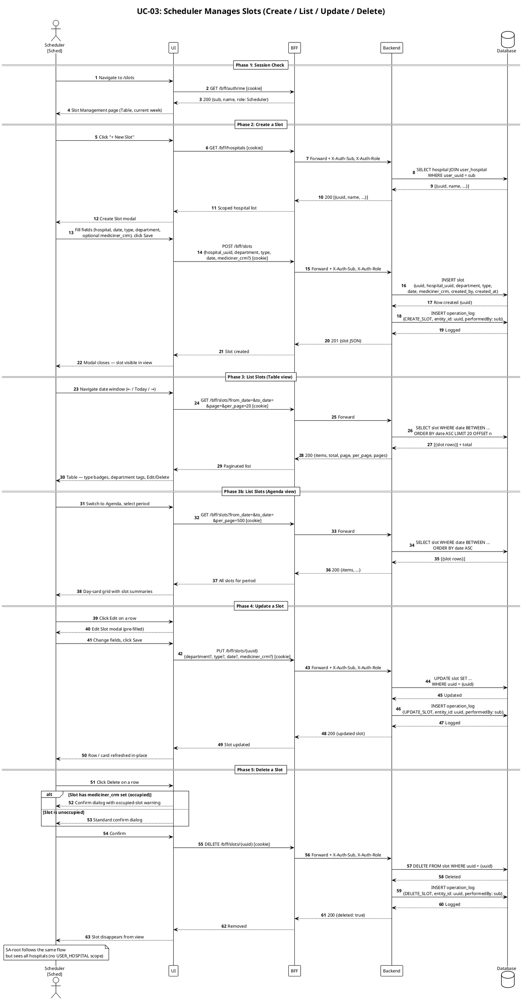

# UC-03: Scheduler Manages Slots — Sequence Diagram

> Covers the full Slot lifecycle for an authenticated Scheduler (or SA-root): **Create**, **List** (Table and Agenda views), **Update**, and **Delete**. Pre-condition: Scheduler is active (UC-02 completed) and has at least one hospital linked via `USER_HOSPITAL`.

---

## Actors & Participants

| Symbol | Meaning |
|---|---|
| **Sched** | Scheduler — authenticated actor; JWT cookie already set |
| **SA** | SA-root — may perform the same slot operations platform-wide |
| **UI** | Frontend application — `/slots` page (SlotManagement) |
| **BFF** | Backend for Frontend — JWT validation, request forwarding |
| **Backend** | Core API — business logic, RBAC, OPERATION_LOG writes |
| **DB** | PostgreSQL — `slot`, `hospital`, `user_hospital`, `operation_log` |

---

## Design Decisions

| # | Question | Answer |
|---|---|---|
| 1 | Who can create slots? | Scheduler (scoped to their hospitals via `USER_HOSPITAL`) and SA-root (all hospitals). |
| 2 | How does the hospital list get scoped? | `GET /hospitals` — Backend checks `g.auth_role`; returns only `USER_HOSPITAL`-linked hospitals for Schedulers; all hospitals for SA-root. |
| 3 | What are valid `department` values? | Enum: `UTI` (ICU) · `PA` (Urgent Care) · `PS` (Emergency Room). |
| 4 | What are valid `type` values? | Enum: `PM` (Physician On-Call) · `PE` (Nursing Duty) · `CC` (Operating Room) · `CM` (Outpatient). |
| 5 | Is `mediciner_crm` validated at slot creation? | No — it is stored as-is (free text, format `CRM/UF XXXXXX`). Live CRM lookup via CFM API is not yet available (licence required). |
| 6 | What happens when deleting an occupied slot? | The frontend shows a pre-DELETE confirmation dialog with an extra warning when `mediciner_crm` is set. The backend DELETE always succeeds; there is no server-side block. |
| 7 | What OPERATION_LOG entries are written? | `CREATE_SLOT`, `UPDATE_SLOT`, `DELETE_SLOT` — one row per write, same transaction. |
| 8 | Is pagination server-side? | Yes — `GET /slots` returns `{items, total, page, per_page, pages}`. Default 20 per page. |
| 9 | What is the Agenda view's default period? | Current calendar week (Monday–Sunday). Other options: +2d, +4d, +8d, 1W, 2W, 1M, Custom date range. |

---

## Mermaid — quick preview

---

## PlantUML — canonical diagram

---

## API Endpoints (UC-03)

| Method | Path | Body / Params | Success | Error |
|---|---|---|---|---|
| `GET` | `/bff/hospitals` | — | 200 `[{uuid, name, cnpj, …}]` scoped by role | 401 |
| `POST` | `/bff/slots` | `{hospital_uuid, department, type, date, mediciner_crm?}` | 201 `{slot JSON}` | 400 invalid enum · 401 |
| `GET` | `/bff/slots` | `?hospital_uuid&from_date&to_date&page&per_page` | 200 `{items, total, page, per_page, pages}` | 401 |
| `PUT` | `/bff/slots/{uuid}` | `{department?, type?, date?, mediciner_crm?}` | 200 `{slot JSON}` | 400 · 404 · 401 |
| `DELETE` | `/bff/slots/{uuid}` | — | 200 `{deleted: true}` | 404 · 401 |

---

## OPERATION_LOG Entries (UC-03)

| Action | Entity type | Entity ID | Written when |
|---|---|---|---|
| `CREATE_SLOT` | `SLOT` | `slot.uuid` | Slot inserted |
| `UPDATE_SLOT` | `SLOT` | `slot.uuid` | Any field mutated |
| `DELETE_SLOT` | `SLOT` | `slot.uuid` | Slot removed |
