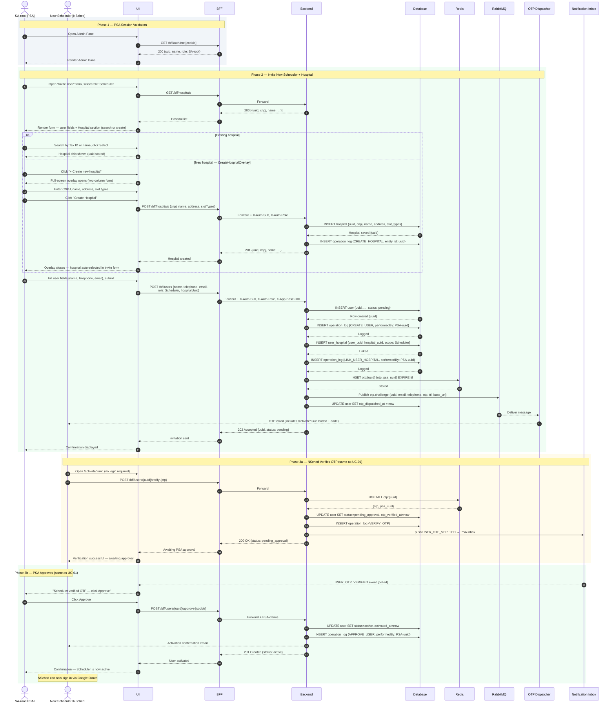
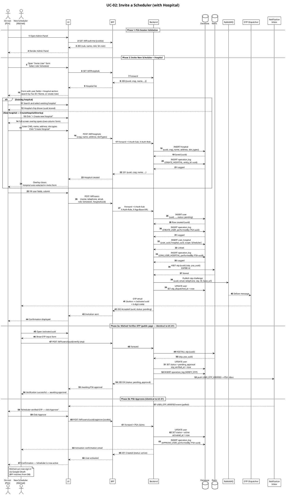

# UC-02: Invite a Scheduler (with Hospital) — Sequence Diagram

> **Relationship to UC-01:** UC-02 extends the SA invite flow. Phases 3a (OTP verification) and 3b (PSA approval) are identical to UC-01 — see `sequence-create-sa.md`. This diagram focuses on the differences: the Hospital section in the invite form and the two-step hospital-then-invite write.

---

## Actors & Participants

| Symbol | Meaning |
|---|---|
| **PSA** | Previous System Administrator — authenticated SA-root who initiates the invitation |
| **NSched** | New Scheduler — receives OTP email; activates account via public link |
| **UI** | Frontend application (React + Vite) |
| **BFF** | Backend for Frontend — JWT validation, request forwarding (Flask) |
| **Backend** | Core API — business logic, RBAC enforcement, OPERATION_LOG writes (Flask) |
| **DB** | PostgreSQL — persists USER, HOSPITAL, USER_HOSPITAL, OPERATION_LOG |
| **Redis** | OTP challenge store |
| **RabbitMQ** | Message broker — `otp.challenge` queue |
| **Dispatcher** | OTP consumer — delivers via email + WhatsApp + SMS |
| **NI** | Notification Inbox — in-memory per-PSA event inbox |

---

## Design Decisions

| # | Question | Answer |
|---|---|---|
| 1 | Can the PSA link a Scheduler to an existing hospital? | **Yes** — Hospital section shows Tax ID search and name search; PSA selects one. |
| 2 | Can the PSA register a new hospital at invite time? | **Yes** — clicking "+ Create new hospital" opens a full-screen overlay (`CreateHospitalOverlay`). The hospital is created via `POST /hospitals` *before* the invite is submitted. The overlay returns the new hospital UUID to the invite form. |
| 3 | Is the hospital mandatory for Schedulers? | **Yes** — submit button is disabled until a hospital is confirmed. |
| 4 | How many hospitals can be linked at invite? | **One.** Additional hospital links are a separate operation. |
| 5 | Are Hospital creation and UserHospital link atomic with user creation? | **Partially.** Hospital creation is a separate prior request. The `USER_HOSPITAL` link is written atomically with the user record inside `CreateUserUseCase`. |
| 6 | What are the valid slot types? | `UTI` · `PS` · `PA` · `CC` · `ENF` (multi-select at hospital creation). |
| 7 | What OPERATION_LOG entries are written? | `CREATE_HOSPITAL` (if new hospital, separate request); `CREATE_USER` always; `LINK_USER_HOSPITAL` always for Schedulers. |
| 8 | What is the Hospital primary key? | `uuid` (surrogate key). `cnpj` is the alternate key (UNIQUE, immutable after creation). |

---

## Mermaid — quick preview

---

## PlantUML — canonical diagram

---

## OPERATION_LOG Entries (UC-02)

| Action | Entity type | Entity ID | Written when |
|---|---|---|---|
| `CREATE_HOSPITAL` | `HOSPITAL` | `hospital.uuid` | Only when new hospital created (separate prior request) |
| `CREATE_USER` | `USER` | `user.uuid` | Always — Scheduler record inserted |
| `LINK_USER_HOSPITAL` | `USER_HOSPITAL` | `user_uuid:hospital_uuid` | Always for Scheduler invites |
| `VERIFY_OTP` | `USER` | `user.uuid` | Invitee submits correct OTP |
| `APPROVE_USER` | `USER` | `user.uuid` | PSA clicks Approve |

---

## Hospital Field Validation

| Field | Rule |
|---|---|
| `cnpj` | 14 chars, no punctuation (stripped server-side); positions 1–8 alphanumeric per IN RFB 2.229/2024. Alternate key — immutable after creation. |
| `name` | Required, non-empty |
| `address` | Required, non-empty |
| `slot_types` | Zero or more values from `SlotType` enum; empty is allowed |

---

## Hospital Endpoints (SA-root only)

| Method | Path | Purpose |
|---|---|---|
| `GET` | `/hospitals` | List all hospitals with scheduler counts |
| `POST` | `/hospitals` | Create hospital; returns `{uuid, cnpj, name, …}` |
| `GET` | `/hospitals/<uuid>` | Get single hospital by UUID |
| `PUT` | `/hospitals/<uuid>` | Update name, address, slot_types (CNPJ immutable) |
