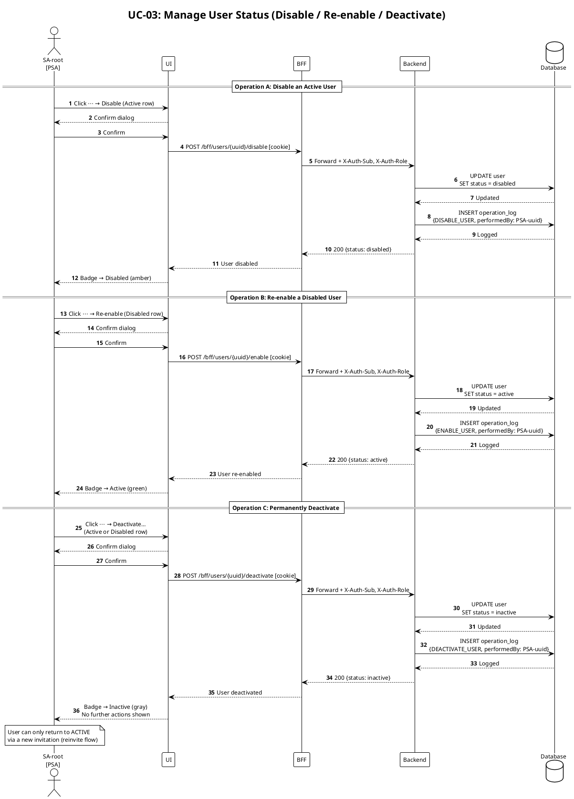

# UC-03: Manage User Status — Sequence Diagram

> Covers three post-activation lifecycle operations available to SA-root: **Disable**, **Re-enable**, and **Deactivate**. The invitation flow (OTP → approval) is covered in `sequence-create-sa.md` and `sequence-invite-scheduler.md`.

---

## Actors & Participants

| Symbol | Meaning |
|---|---|
| **PSA** | System Administrator (SA-root) performing the action |
| **UI** | Frontend application — User List screen |
| **BFF** | Backend for Frontend — JWT validation, request forwarding |
| **Backend** | Core API — business logic, OPERATION_LOG writes |
| **DB** | PostgreSQL — USER table, OPERATION_LOG |

---

## State Machine

```
PENDING ──(verifyOTP)──> PENDING_APPROVAL ──(approve)──> ACTIVE
   │                              │                        │   ↑
   └──(cancelInvitation)──────────┘                 disable│   │enable
                                                           ↓   │
                                                        DISABLED
                                                           │
                                           deactivate ─────┴──── deactivate (also from ACTIVE)
                                                           ↓
                                                        INACTIVE ──(reinvite)──> PENDING
```

---

## Design Decisions

| # | Question | Answer |
|---|---|---|
| 1 | What triggers a "Disable"? | SA-root clicks ⋯ → Disable on an Active user row. |
| 2 | Can a disabled user log in? | No — BFF login check (`GET /users/by-email`) already filters `status == ACTIVE`; disabled users are rejected automatically. |
| 3 | Is "Deactivate" reversible? | Only through a new invitation (`reinvite()` flow). The record is preserved with `status = inactive`. |
| 4 | What is the difference between "Cancel invitation" (UC-01) and "Deactivate" (UC-03)? | Cancel acts on PENDING/PENDING_APPROVAL users (invitation not yet completed). Deactivate acts on ACTIVE/DISABLED users (fully onboarded). Both set `status = inactive`. |
| 5 | Are there new timestamp fields? | No — status change is sufficient in v1; audit trail is in OPERATION_LOG. |
| 6 | What OPERATION_LOG action strings are used? | `DISABLE_USER`, `ENABLE_USER`, `DEACTIVATE_USER`. |

---

## Mermaid — quick preview

```mermaid
sequenceDiagram
    autonumber
    actor PSA as SA-root [PSA]
    participant UI
    participant BFF
    participant BE as Backend
    participant DB as Database

    rect rgb(255,247,237)
        Note over PSA,DB: Operation A — Disable an Active User
        PSA->>UI: Click ⋯ → Disable (on an Active row)
        UI->>UI: Confirm dialog — "Disable this user?"
        PSA->>UI: Confirm
        UI->>BFF: POST /bff/users/{uuid}/disable [cookie]
        BFF->>BE: Forward + X-Auth-Sub, X-Auth-Role
        BE->>DB: UPDATE user SET status = disabled WHERE uuid = {uuid}
        DB-->>BE: Updated
        BE->>DB: INSERT operation_log {DISABLE_USER, performedBy: PSA-uuid}
        DB-->>BE: Logged
        BE-->>BFF: 200 {status: disabled}
        BFF-->>UI: User disabled
        UI-->>PSA: Badge changes to Disabled (amber)
    end

    rect rgb(240,253,244)
        Note over PSA,DB: Operation B — Re-enable a Disabled User
        PSA->>UI: Click ⋯ → Re-enable (on a Disabled row)
        UI->>UI: Confirm dialog — "Re-enable this user?"
        PSA->>UI: Confirm
        UI->>BFF: POST /bff/users/{uuid}/enable [cookie]
        BFF->>BE: Forward + X-Auth-Sub, X-Auth-Role
        BE->>DB: UPDATE user SET status = active WHERE uuid = {uuid}
        DB-->>BE: Updated
        BE->>DB: INSERT operation_log {ENABLE_USER, performedBy: PSA-uuid}
        DB-->>BE: Logged
        BE-->>BFF: 200 {status: active}
        BFF-->>UI: User re-enabled
        UI-->>PSA: Badge changes to Active (green)
    end

    rect rgb(254,242,242)
        Note over PSA,DB: Operation C — Permanently Deactivate (Active or Disabled)
        PSA->>UI: Click ⋯ → Deactivate… (on Active or Disabled row)
        UI->>UI: Confirm dialog — "Permanently deactivate this user?"
        PSA->>UI: Confirm
        UI->>BFF: POST /bff/users/{uuid}/deactivate [cookie]
        BFF->>BE: Forward + X-Auth-Sub, X-Auth-Role
        BE->>DB: UPDATE user SET status = inactive WHERE uuid = {uuid}
        DB-->>BE: Updated
        BE->>DB: INSERT operation_log {DEACTIVATE_USER, performedBy: PSA-uuid}
        DB-->>BE: Logged
        BE-->>BFF: 200 {status: inactive}
        BFF-->>UI: User deactivated
        UI-->>PSA: Badge changes to Inactive (gray); no further actions shown
    end
```

---

## PlantUML — canonical diagram



---

## API Endpoints Added (UC-03)

| Method | Path | Body | Success | Error |
|---|---|---|---|---|
| POST | `/bff/users/{uuid}/disable` | `{}` | 200 `{status: disabled}` | 404 not found · 422 wrong status |
| POST | `/bff/users/{uuid}/enable` | `{}` | 200 `{status: active}` | 404 not found · 422 wrong status |
| POST | `/bff/users/{uuid}/deactivate` | `{}` | 200 `{status: inactive}` | 404 not found · 422 wrong status |
